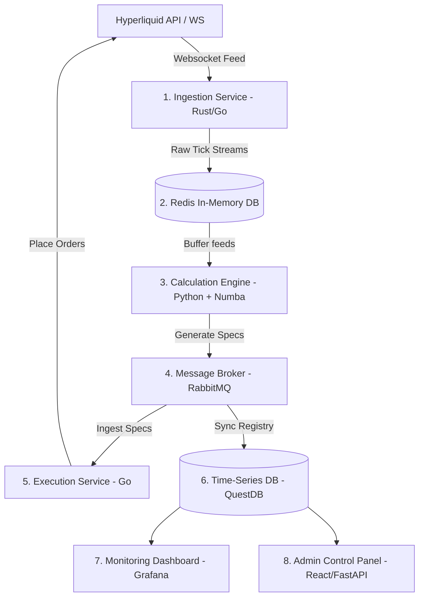

# Kế hoạch Nâng cấp Toàn phần - Research OS Production Grade

Tài liệu này vạch ra lộ trình kỹ thuật chi tiết để chuyển đổi hệ thống **Research OS V3** từ một mô hình MVP nguyên khối (Monolith) thành một hệ thống giao dịch tự động phân tán (Distributed Quantitative Trading System) hiệu năng cao, độ trễ thấp và sẵn sàng chạy tiền thật.

---

## 1. Kiến trúc Mục tiêu (Target Microservices Architecture)

Để đảm bảo khả năng mở rộng (scale) lên hàng chục cặp tiền tệ và hàng trăm tín hiệu đồng thời, hệ thống sẽ được phân rã thành các dịch vụ độc lập:

### Chi tiết các thành phần:
1.  **Dịch vụ thu thập dữ liệu (Ingestion Service)**: Viết bằng **Rust** hoặc **Go** để tối ưu hóa I/O và quản lý bộ nhớ. Dịch vụ này duy trì kết nối Websocket với sàn, xử lý Reconnection, Ping/Pong Heartbeat và ghi đè dữ liệu thô cực nhanh vào Redis.
2.  **Bộ đệm RAM (Redis)**: Sử dụng Redis Streams làm hàng đợi dữ liệu thô (ticks, orderbook depths, candle updates) để giảm thiểu độ trễ đọc/ghi.
3.  **Engine tính toán (Calculation Engine)**: Chạy bằng **Python** nhưng sử dụng **Numba (JIT)** hoặc **Polars** để biên dịch các thuật toán tính chỉ báo kỹ thuật (EMA, MACD, BB) thành mã máy, triệt tiêu hoàn toàn vòng lặp Python chậm chạp.
4.  **Hàng đợi thông điệp (RabbitMQ)**: Điều phối các gói tin đặc tả chiến lược (`strategy_specs`) và playbook một cách phi đồng bộ, đảm bảo không làm mất dữ liệu khi một dịch vụ gặp sự cố.
5.  **Dịch vụ thực thi (Execution Service)**: Viết bằng **Go** để tận dụng tính năng Concurrency cực mạnh, thực hiện ký số giao dịch (API Key signature) và đẩy lệnh lên sàn Hyperliquid với độ trễ tối thiểu (<10ms).
6.  **Cơ sở dữ liệu lịch sử (QuestDB/TimescaleDB)**: Lưu trữ toàn bộ dữ liệu thị trường và lịch sử phát hành tín hiệu để phục vụ nghiên cứu và Backtest offline.

---

## 2. Kế hoạch Triển khai theo Giai đoạn (Roadmap)

### Giai đoạn 1: Nâng cấp Core & Tối ưu hóa Hiệu năng (Thực hiện trong 3-4 tuần)
*   **[ ] Tối ưu hóa giải thuật chỉ báo**: 
    *   Thay thế toàn bộ vòng lặp trong `realtime_engine.py` bằng các hàm vector hóa của NumPy hoặc thư viện `pandas-ta`.
    *   Chuyển đổi tính toán MACD và Bollinger Bands sang cơ chế lũy kế (Incremental Update) - chỉ tính toán dựa trên giá trị nến mới nhất thay vì chạy lại vòng lặp trên 500 nến cũ.
*   **[ ] Thay thế I/O đồng bộ bằng Async**:
    *   Sử dụng thư viện `aiofiles` hoặc tích hợp cơ sở dữ liệu SQLite/PostgreSQL chạy phi đồng bộ thay cho việc ghi đè file JSONL thủ công.
*   **[ ] Tách biệt Web Dashboard khỏi luồng Trading**:
    *   Chuyển luồng Web dashboard sang chạy trên một cổng riêng, giao tiếp với Trading Engine thông qua Redis Pub/Sub để tránh nghẽn luồng xử lý chính.

### Giai đoạn 2: Tích hợp Engine Backtest thực tế & Calibrator (Thực hiện trong 4-5 tuần)
*   **[ ] Tích hợp Event-Driven Backtester**:
    *   Tích hợp framework **NautilusTrader** hoặc xây dựng một engine Backtest mô phỏng khớp lệnh sự kiện (Event-Driven) sử dụng dữ liệu nến 1-giây (1s) và dữ liệu Tick lịch sử.
    *   Mô phỏng chính xác chi phí giao dịch (Maker/Taker fees của Hyperliquid) và độ trượt giá (Slippage) dựa trên độ sâu sổ lệnh (Orderbook Depth).
*   **[ ] Xây dựng mô-đun Tối ưu hóa động (Offline Calibrator)**:
    *   Sử dụng framework **Optuna** chạy định kỳ hàng ngày (cronjob) để quét dữ liệu lịch sử 30 ngày gần nhất.
    *   Tự động cập nhật các ngưỡng tối ưu (ví dụ: `BollingerWidth` trigger threshold, `ZScore_Close` entry limit) vào file `config.json` của hệ thống live mà không cần dừng bot.

### Giai đoạn 3: Hiện thực hóa Luồng Thực thi (Execution Broker) (Thực hiện trong 4 tuần)
*   **[ ] Kết nối API Đặt lệnh Hyperliquid**:
    *   Viết module ký giao dịch bảo mật bằng private key của ví Arbitrum L2 (dùng cho Hyperliquid).
    *   Triển khai các lệnh thông minh: Limit order với cơ chế Post-Only (tránh mất phí Taker), Market order với cơ chế bảo vệ trượt giá tối đa (Slippage limit).
*   **[ ] Quản lý trạng thái lệnh (Order State Parity)**:
    *   Đồng bộ trạng thái lệnh giữa Bot và sàn qua kênh Websocket `orderUpdates`. Đảm bảo hệ thống phát hiện được lệnh bị từ chối (reject), khớp một phần (partially filled) hoặc bị hủy (cancelled).

### Giai đoạn 4: Quản trị rủi ro & Hệ thống Cảnh báo (Thực hiện trong 2-3 tuần)
*   **[ ] Cảnh báo tự động (Alerting Gateway)**:
    *   Tích hợp Telegram Bot / Discord Webhook để gửi thông báo tức thời khi:
        *   Tài khoản chạm ngưỡng dừng lỗ ngày (Daily Loss Cap).
        *   Mất kết nối Websocket với sàn quá 10 giây.
        *   Gặp lỗi thực thi lệnh (API error, Insufficient margin).
*   **[ ] Kill Switch Cấp độ 2**:
    *   Triển khai cơ chế khẩn cấp: Tự động hủy toàn bộ lệnh chờ (cancel all open orders) và đóng toàn bộ vị thế đang mở (market close all positions) khi tài khoản sụt giảm vốn quá mức quy định.

---

## 3. Chỉ số Đo lường Chất lượng (KPIs cho Sản phẩm Thật)

Hệ thống nâng cấp sẽ được đánh giá dựa trên các tiêu chuẩn định lượng nghiêm ngặt sau:

| Chỉ số | Hiện tại (MVP) | Mục tiêu (Production) | Cách đo lường |
| :--- | :--- | :--- | :--- |
| **Độ trễ xử lý tín hiệu (Signal Latency)** | ~50ms - 200ms | **< 15ms** | Đo từ lúc nhận tick Websocket đến khi xuất Spec |
| **Tỷ lệ mất gói tin (Websocket Drop Rate)** | Chưa đo lường | **0.00%** | Theo dõi sequence ID của tin nhắn từ sàn |
| **Mức tiêu thụ CPU (ở trạng thái tĩnh)** | Rất cao (chạy vòng lặp) | **< 5%** | Giám sát qua Docker stats trên VPS |
| **Mô phỏng Backtest** | Giả lập toán học | **Độ khớp khớp lệnh thực tế > 95%** | So sánh kết quả backtest và kết quả chạy live demo |
| **Độ ổn định hệ thống (Uptime)** | Phụ thuộc vào main process | **99.99%** | Tự động khởi động lại qua Docker Restart Policy & PM2 |
