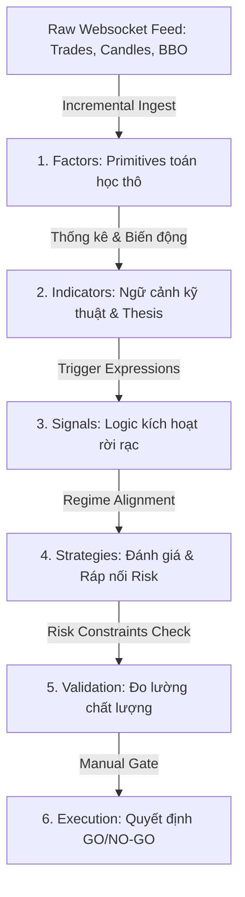

# Nghiên Cứu Chuyên Sâu: Luồng Tổng Hợp Alpha & Mối Tương Quan Kiến Trúc Trong Research OS V3

Tài liệu này trình bày nghiên cứu phân tích chuyên sâu về cấu trúc luồng xử lý dữ liệu (pipeline) của hệ thống **Research OS V3**, tập trung làm rõ vai trò, bản chất, mối liên kết và sự tương quan giữa các lớp: **Factors**, **Indicators**, **Signals**, và **Strategies**.

---

## 1. Tổng Quan Đường Ống Dữ Liệu (Data Pipeline)

Hệ thống Research OS V3 hoạt động dựa trên nguyên tắc **"Disciplined Ingestion & Synthesis"** (Đầu vào có kỷ luật và Tổng hợp phân cấp). Luồng xử lý từ dữ liệu thị trường thô (raw market data) đến quyết định giao dịch (trade execution) tuân thủ nghiêm ngặt mô hình phân tầng sau:

---

## 2. Phân Tích Chi Tiết Từng Lớp Kiến Trúc

### 2.1. Factors (Nhân Tố Toán Học Thô)
*   **Bản chất**: Là các đặc trưng toán học nguyên bản (raw mathematical features) được tính toán trực tiếp từ dữ liệu dòng lệnh (Trades), sổ lệnh (BBO), giá trung bình (Mids) và nến giá (OHLCV).
*   **Đặc điểm**:
    *   Tính toán lũy tiến (incremental) theo thời gian thực (realtime) với tần suất cực cao (10-50Hz).
    *   Tập trung vào độ trễ cực thấp (low-latency) và sử dụng thư viện tăng tốc NumPy (`factor_math.py`).
*   **Ví dụ tiêu biểu trong dự án**:
    *   `ret_1`, `ret_5`: Lợi suất thay đổi của 1 nến và 5 nến gần nhất.
    *   `volatility_20`: Độ lệch chuẩn của lợi suất trong 20 chu kỳ.
    *   `trade_flow_imbalance_50`: Sự mất cân bằng dòng lệnh mua/bán trong 50 giao dịch gần nhất (Order Flow Imbalance - OFI).
    *   `large_trade_ratio`: Tỷ lệ các lệnh lớn vượt ngưỡng trung bình.

---

### 2.2. Indicators (Chỉ Báo & Ngữ Cảnh Kỹ Thuật)
*   **Bản chất**: Là các công cụ đo lường và định vị thị trường được tổng hợp từ Factors và chuỗi giá đóng cửa. Indicators cung cấp cấu trúc ngữ cảnh kỹ thuật (structural context) cho dữ liệu.
*   **Thesis (Giả thuyết nghiên cứu)**: Chỉ báo đại diện cho một giả thuyết thống kê về trạng thái thị trường. Ví dụ: Bollinger Bands đại diện cho giả thuyết biến động phân phối chuẩn xung quanh giá trị trung bình; MACD đại diện cho động lượng tiếp diễn xu hướng.
*   **Template (Mẫu cấu trúc)**: Các thuật toán chỉ báo có thể tham số hóa (e.g. Bollinger Bands với chu kỳ $N$ và hệ số độ lệch chuẩn $K$).
*   **Ví dụ tiêu biểu trong dự án**:
    *   `BBANDS_upper`, `BBANDS_lower`, `BollingerWidth`: Định biên biến động.
    *   `ZScore_Close`: Xác định khoảng cách lệch chuẩn của giá hiện tại so với trung bình 20 nến.
    *   `rsi_14`: Chỉ số sức mạnh tương đối.
    *   `momentum_divergence`, `rsi_divergence`: Sự phân kỳ động lượng (phát hiện đỉnh/đáy fractal).

---

### 2.3. Signals (Tín Hiệu Kích Hoạt Rời Rạc)
*   **Bản chất**: Là các điều kiện logic logic-boolean (True/False) được kích hoạt dựa trên các ngưỡng giá trị cụ thể của Indicators.
*   **Thesis (Giả thuyết tín hiệu)**: Một giả thuyết hành vi giao dịch cụ thể khi đạt đến giới hạn thống kê. Ví dụ: Khi `ZScore_Close` xuống dưới `-1.5` đồng thời `RSI` dưới `30` (quá bán), giả thuyết đảo chiều tăng giá được kích hoạt.
*   **Template (Mẫu cấu trúc)**: Bao gồm 3 khối logic cốt lõi được định nghĩa động thông qua JSON:
    1.  `trigger_definition`: Điều kiện bắt đầu kích hoạt tín hiệu (e.g. `zscore <= -1.5`).
    2.  `confirmation_definition`: Điều kiện xác nhận để giảm thiểu tín hiệu nhiễu (e.g. `rsi_14 > 30`).
    3.  `invalidation_definition`: Điều kiện hủy bỏ tín hiệu ngay lập tức nếu thị trường đảo chiều bất lợi.
*   **Ví dụ tiêu biểu trong dự án**:
    *   `zscore_recenter`: Mean reversion signal.
    *   `macd_trend_continuation`: Trend following signal.
    *   `bollinger_squeeze_breakout`: Volatility expansion signal.

---

### 2.4. Strategies (Chiến Lược Giao Dịch Toàn Diện)
*   **Bản chất**: Là sự tổng hợp tối cao kết hợp Signals với **Regime Classification** (Phân loại trạng thái thị trường) và **Risk Engine** (Động cơ quản trị rủi ro) để đưa ra đề xuất vị thế cụ thể.
*   **Thesis (Giả thuyết chiến lược)**: Hệ thống hóa logic để sinh ra lợi nhuận bền vững. Thesis xác định mối quan hệ tương quan: *"Chiến lược Xu hướng chỉ chạy trong thị trường Xu hướng (Uptrend/Downtrend), và Chiến lược Đảo chiều chỉ chạy trong thị trường Dao động tích lũy (Range Chop)."*
*   **Template (Mẫu cấu trúc)**: Cấu trúc hóa chiến lược thành một gói dữ liệu đầy đủ bao gồm: `entry_side`, `stop_loss`, `take_profit`, `target_quantity`, và `risk_status`.
*   **Quality (Chất lượng chiến lược)**: Được đánh giá động qua Risk Engine. Các bộ lọc rủi ro như giới hạn chênh lệch giá (spread limits), biến động vi mô (micro volatility bounds), và giới hạn vị thế đồng thời (max concurrent candidates) quyết định chiến lược có được duyệt giao dịch hay không (`allow_entry`).
*   **Verified (Trạng thái kiểm định)**: Vòng đời kiểm thử (Backtest -> Paper Test -> Live Gating). Được hệ thống kiểm định hiệu năng (Validation Runner) tính toán các thông số thực tế: Sharpe Ratio, Win Rate, Profit Factor, Max Drawdown để cấp trạng thái phê duyệt (Promotion).

---

## 3. Mối Quan Hệ Và Tương Quan Giữa Các Lớp

Mỗi lớp trong Research OS V3 đóng vai trò là một màng lọc kỷ luật cho lớp tiếp theo:

| Lớp | Vai trò đối với lớp tiếp theo | Tương quan lỗi (Propagation of Errors) |
| :--- | :--- | :--- |
| **Factors ➔ Indicators** | Làm sạch tín hiệu thô, chuyển đổi nhiễu thời gian thực thành chỉ báo xu thế & biến động. | Nếu Factors bị nhiễu do lỗi lấy mẫu dữ liệu giá, Indicators sẽ vẽ ra các mức cản/hỗ trợ sai lệch. |
| **Indicators ➔ Signals** | Xác lập các mốc điều kiện logic rõ ràng để chuyển trạng thái liên tục thành rời rạc. | Nếu Bollinger Width không được cập nhật stale-value đúng chu kỳ (Lỗi timing), tín hiệu Breakout sẽ bị liệt hoặc kích hoạt sai thời điểm. |
| **Signals ➔ Strategies** | Cung cấp động lực giao dịch. Chiến lược bao bọc tín hiệu bằng kỷ luật vốn (Position Sizing) và kỷ luật trạng thái (Regime Filter). | Tín hiệu Xu hướng chạy trong vùng tích lũy (Range Chop) sẽ tạo ra chuỗi thua lỗ liên tiếp nếu Chiến lược không có màng lọc Regime. |
| **Strategies ➔ Validation** | Tạo ra nhật ký giao dịch thực tế để chạy thuật toán tối ưu hóa danh mục. | Kết quả giao dịch thực tế xác định điểm suy thoái của chiến lược (Alpha Decay) để tự động hạ cấp. |

---

## 4. Bản Đồ Phân Bổ Kiến Trúc Trong Mã Nguồn

Dưới đây là sơ đồ phân bổ các thành phần trong các file nguồn của dự án Research OS V3:

*   **Tính toán Toán học**:
    *   [factor_math.py](file:///c:/Users/Black/Downloads/ResearchOS/research-os-v3/factor_math.py): Thư viện lõi chứa toàn bộ công thức tính toán nâng tốc của **Factors** và **Indicators** (EMA, MACD, Bollinger Bands, Z-Score, Divergence).
*   **Quản lý Thư viện & Cấu hình**:
    *   `factor_catalog_v1.json`: Danh mục các Factors được định nghĩa sẵn.
    *   `signal_template_library_v1.json`: Thư viện mẫu cấu trúc của **Signals**.
*   **Điều phối & Đánh giá Trạng thái**:
    *   [regime_engine.py](file:///c:/Users/Black/Downloads/ResearchOS/research-os-v3/regime_engine.py): Đảm nhận nhiệm vụ phân loại thị trường thành các Regimes nhằm bật/tắt các loại tín hiệu tương thích.
    *   [signal_orchestrator.py](file:///c:/Users/Black/Downloads/ResearchOS/research-os-v3/signal_orchestrator.py): Nạp các tín hiệu từ Alpha Registry, đánh giá các biểu thức điều kiện (trigger, confirm, invalidate) theo thời gian thực.
    *   [realtime_engine.py](file:///c:/Users/Black/Downloads/ResearchOS/research-os-v3/realtime_engine.py): Trái tim điều phối luồng dữ liệu tuần tự.
*   **Rủi ro & Kiểm định**:
    *   [risk_engine.py](file:///c:/Users/Black/Downloads/ResearchOS/research-os-v3/risk_engine.py): Thực hiện kiểm tra rủi ro (Risk Quality) của **Strategies**.
    *   `validation_runner.py`: Đánh giá hiệu suất thực tế của chiến lược giao dịch để quyết định trạng thái phê duyệt (Verified).

---

## 5. Kết Luận & Khuyến Nghị Phát Triển Alpha

1.  **Tính Nhất Quán Của Dữ Liệu**: Việc chuyển tiếp giữa Factors ➔ Indicators ➔ Signals phải đảm bảo tính đồng bộ về mặt thời gian (Time-series alignment). Các lỗi lệch pha thời gian (Lookahead bias hoặc Stale price) cần được ngăn chặn bằng các bộ kiểm thử tự động (như `test_logic_fixes.py`).
2.  **Cân Bằng Giữa Tần Suất Và Độ Nhiễu**: Factors ở tần suất cao (HFT) cần được kiểm soát chặt chẽ bởi các bộ lọc rủi ro của Strategies (Spread bps limits) để tránh việc vào lệnh liên tục gây tổn thất phí giao dịch (slippage/fees).
3.  **Tối Ưu Hóa Regime**: Phân loại Regime chính xác là chìa khóa vàng bảo vệ danh mục đầu tư. Việc thắt chặt bộ lọc `range_chop` và hạn chế các tín hiệu xu hướng trong vùng tích lũy giúp cải thiện tỷ lệ Win Rate của tổng thể hệ thống lên đáng kể.
